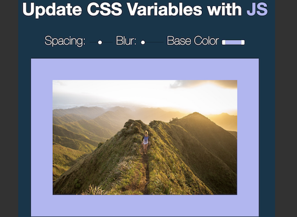

Vanilla JavaScript Experiments
===

Wes Bos JS30 Challenge
---

| | | |
|:-------------------------:|:-------------------------:|:-------------------------:|
|<a href="https://whatapalaver.github.io/javascriptings/wes30/simple_drumkit/">  Drumkit </a>  |  <a href="https://whatapalaver.github.io/javascriptings/wes30/clock/">CSS/JS Clock </a> |<a href="https://whatapalaver.github.io/javascriptings/wes30/css_var/"> CSS Variables</a> |
| | | |
|<a href="https://whatapalaver.github.io/javascriptings/wes30/array_cardio/"> Array Cardio </a> |  <a href="https://whatapalaver.github.io/javascriptings/wes30/clock/"> ? </a> |<a href="https://whatapalaver.github.io/javascriptings/wes30/css_var/"> ? </a> |

1) [A Simple Drumkit](https://whatapalaver.github.io/javascriptings/wes30/simple_drumkit/) - featuring css grid and image transitions

2) [A CSS and JS Clock](https://whatapalaver.github.io/javascriptings/wes30/clock/) - featuring some ugly 0 sec transitions!

3) [CSS Variables](https://whatapalaver.github.io/javascriptings/wes30/css_var/)

4) [Array Cardio](https://whatapalaver.github.io/javascriptings/wes30/array_cardio/)