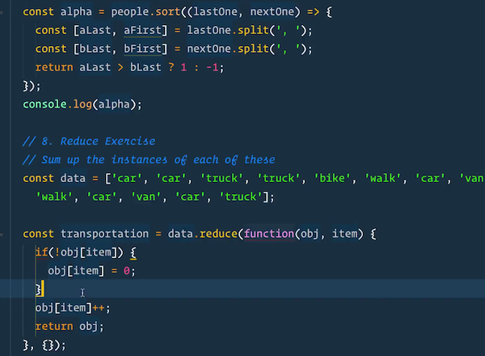
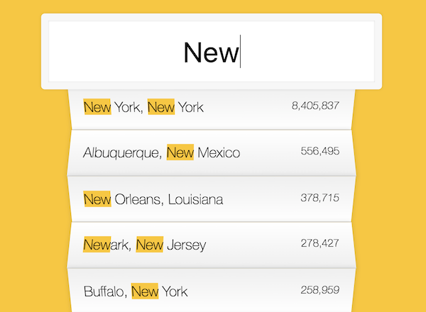
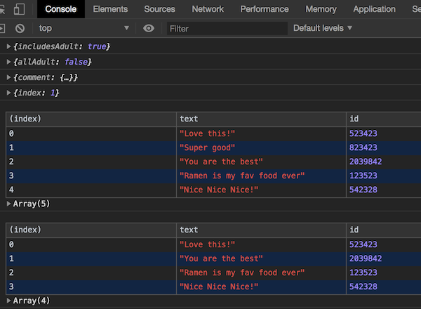
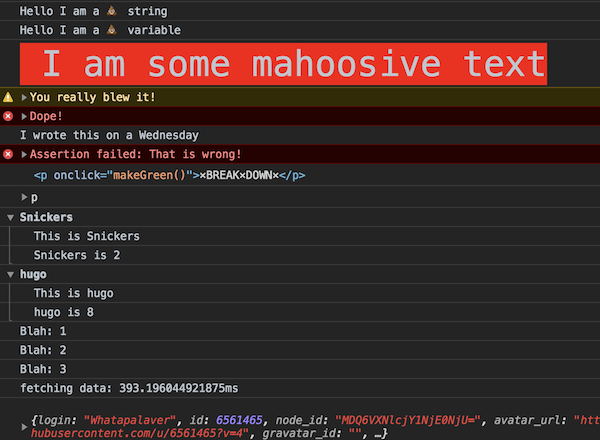

Vanilla JavaScript Experiments
===

Wes Bos JS30 Challenge
---

| | | |
|:-------------------------:|:-------------------------:|:-------------------------:|
|<a href="https://whatapalaver.github.io/javascriptings/wes30/simple_drumkit/">  Drumkit </a>  |  <a href="https://whatapalaver.github.io/javascriptings/wes30/clock/">CSS/JS Clock </a> |<a href="https://whatapalaver.github.io/javascriptings/wes30/css_var/"> CSS Variables</a> |
| | | |
|<a href="https://whatapalaver.github.io/javascriptings/wes30/array_cardio/"> Array Cardio </a> |  <a href="https://whatapalaver.github.io/javascriptings/wes30/flex_panel/"> Flex Panel </a> |<a href="https://whatapalaver.github.io/javascriptings/wes30/type_ahead/"> Ajax Search </a> |
| | | |
|<a href="https://whatapalaver.github.io/javascriptings/wes30/array_cardio2/"> Array Cardio 2 </a> |  <a href="https://whatapalaver.github.io/javascriptings/wes30/canvas/"> HTML 5 Canvas </a> |<a href="https://whatapalaver.github.io/javascriptings/wes30/dev_tricks/"> Top Dev Tricks </a> |
| | | |

1) [A Simple Drumkit](https://whatapalaver.github.io/javascriptings/wes30/simple_drumkit/) - featuring css grid and image transitions

2) [A CSS and JS Clock](https://whatapalaver.github.io/javascriptings/wes30/clock/) - featuring some ugly 0 sec transitions!

3) [CSS Variables](https://whatapalaver.github.io/javascriptings/wes30/css_var/)

4) [Array Cardio](https://whatapalaver.github.io/javascriptings/wes30/array_cardio/) - some useful examples of map, sort and reduce functions

5) [Flex Panel](https://whatapalaver.github.io/javascriptings/wes30/flex_panel/) - JS transitions with flex box. 

6) [Ajax and Search](https://whatapalaver.github.io/javascriptings/wes30/type_ahead/) - Fetch json data, display highlighted results based on search term.

7) [Array Cardio 2](https://whatapalaver.github.io/javascriptings/wes30/array_cardio2/) - array functions: some, every, find and findIndex.

8) [HTML 5 Canvas](https://whatapalaver.github.io/javascriptings/wes30/canvas/) - a recreation of MS paint in the canvas.

9) [Top Dev Tricks](https://whatapalaver.github.io/javascriptings/wes30/dev_tricks/) - console tricks
